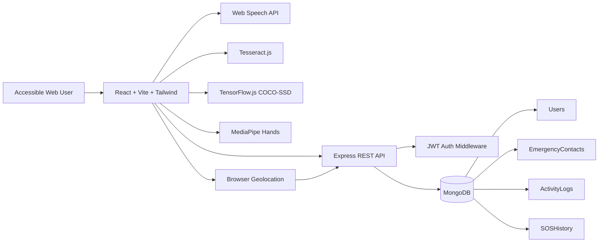

# Project Architecture

## Design Notes

- AI features run primarily in the browser to reduce server cost and latency.
- The backend persists user data, emergency contacts, activity logs, and SOS history.
- JWT protects all private APIs.
- Accessibility preferences are stored in each user profile and reflected in the UI.
